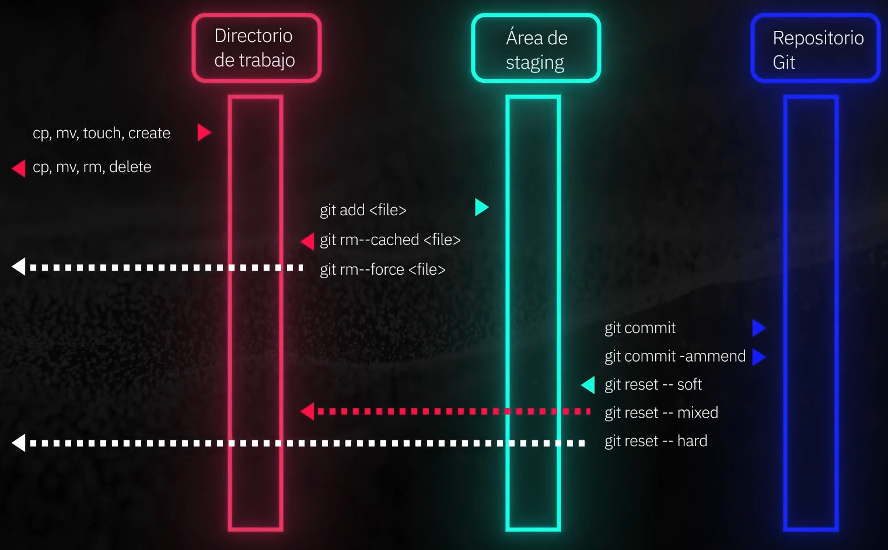

# 📚 Curso de Git y GitHub


**Fecha:** 26/11/2024

**Enlace del Curso:** [Git y GitHub en Platzi](https://platzi.com/cursos/gitgithub/ "Enlace Curso Git y GitHub")

**Profesor:** Amin Espinoza

## 🗂 Estructura del Repositorio
```bash
Git & GitHub/
├── commands/               # Carpeta que contiene documentación sobre comandos de Git
│   ├── commands.pdf
│   └── commands.md
├── documentation/          # Carpeta que contiene la documentación completa del curso
│   └── course.md
└── images/                 # Carpeta con las imágenes usadas en course.md
```

## 🔍 Información General

Git es un **controlador de versiones** que permite a los desarrolladores trabajar de forma colaborativa en proyectos de software. Fue creado por **Linus Torvalds** y es **Open Source**.  

Git puede usarse tanto en máquinas locales como en IDEs como **Visual Studio Code**, y ofrece varios eventos importantes como **push**, **pull**, **commits**, entre otros.

## ⚙️ Configuración Inicial

En sistemas **Linux** y **WSL**, **Git** viene preinstalado. Para verificar la versión de Git, ejecuta el siguiente comando:

```bash
git --version
```

Esto debería devolver la versión de Git instalada en tu sistema.

### 🌱 Inicialización de un Repositorio

Para comenzar, utilizaremos esta carpeta para realizar prácticas con **Git** y **GitHub**. Ejecuta el siguiente comando para inicializar un repositorio Git en tu proyecto:

```bash
git init
```

Esto creará una rama por defecto llamada `master`, pero actualmente Git utiliza **`main`** como nombre por defecto para la rama principal. Para cambiar esto, ejecuta el siguiente comando:

```bash
git config --global init.defaultBranch main
```

No obtendrás una respuesta en la terminal, pero este comando hará que **`main`** sea la nueva rama predeterminada al inicializar un repositorio.

Para cambiar el nombre de la rama principal de `master` a `main`, ejecuta:

```bash
git branch -m main
```

### 📜 Documentación de Comandos

Para obtener ayuda sobre los comandos de Git, puedes usar:

```bash
git --help
```

Esto mostrará una guía breve de los comandos disponibles directamente en la terminal.

### 🧑‍💻 Configuración del Usuario

Es importante configurar tu nombre y correo electrónico para que Git registre correctamente quién está realizando los cambios en el repositorio. Ejecuta los siguientes comandos para configurarlos:

```bash
git config --global user.name "Tu Nombre"
```

```bash
git config --global user.email "usuario@correo.com"
```

⚠️ **Nota:** El parámetro **`--global`** aplica esta configuración a todos los repositorios de tu máquina, no solo a este repositorio específico.

### 🧐 Verificación de la Configuración

Para verificar que todo esté configurado correctamente, ejecuta:

```bash
git config --list
```

Esto mostrará todas las configuraciones activas de Git en tu sistema.

## Comandos básicos

Anteriormente se inicializó git con el comando:

```bash
git init
```

Esto lo que hace es crear una carpeta oculta en el directoro donde se ejecutó el comando, para verla se puede ejecutar el comando:

```bash
ls -a
```

Esto lo que hará es mostrar carpetas ocultas y veremos la carpeta `.git`, esta carpeta guardará un registro detallado de todos los cambios realizados en los archivos.

Para ello podemos probarlo creando una carpeta practice donde se almacenará la práctica de este curso y se creará un archivo test.txt escribiendo un hola mundo.

Ahora que esos cambios fueron realizados hacemos el comando:
```bash
git status
```

Esto dará una respuesta en terminal asi:
```bash
On branch main          # Rama Actual

No commits yet          # No he realizado ningún commit

Untracked files:        # Se crearon o modificaron estos archivos/carpetas
  (use "git add <file>..." to include in what will be committed)
        ../commands/
        ../documentation/
        ../images/
        ./

                        # Recomendación de comandos de git
nothing added to commit but untracked files present (use "git add" to track)
```

Se puede hacer el comando para añadir los cambios:
```bash
git add .
```
```bash
git add /ruta_archivo
```
Lo que hará el primer comando es añadir el todos los cambios al registro y el segundo lo hará por un archivo específico indicando la ruta de ese archivo y una vez hecho el comando podemos preguntar el status nuevamente y obtendremos esto:

```bash
On branch main

No commits yet

# Los archivos han sido registrados pero sin un commit
Changes to be committed:
  (use "git rm --cached <file>..." to unstage)
        new file:   commands/commands.md
        new file:   commands/commands.pdf
        new file:   documentation/course.md
        new file:   images/banner.png
        new file:   practice/test.txt
```

Dentro de un proyecto se escribe $git add, los archivos pasan a la etapa de "Staging" es como un limbo luego puede suceder dos cosas, la primera es regresar como un archivo normal o la segunda con $git commit se puede ingresar al control de versiones de git


En un mejor flujo


