# 📚 Curso de Git y GitHub


**Fecha:** 26/11/2024

**Enlace del Curso:** [Git y GitHub en Platzi](https://platzi.com/cursos/gitgithub/ "Enlace Curso Git y GitHub")

**Profesor:** amin Espinoza

## 🗂 Estructura del Repositorio

```bash
Git & GitHub/
├── commands/               # Carpeta que contiene documentación sobre comandos de Git
│   ├── commands.pdf
│   └── commands.md
├── documentation/          # Carpeta que contiene la documentación completa del curso
│   └── course.md
└── images/                 # Carpeta con las imágenes usadas en course.md
```

## 🔍 Información General

Git es un **controlador de versiones** que permite a los desarrolladores trabajar de forma colaborativa en proyectos de software. Fue creado por **Linus Torvalds** y es **Open Source**.  

Git puede usarse tanto en máquinas locales como en IDEs como **Visual Studio Code**, y ofrece varios eventos importantes como **push**, **pull**, **commits**, entre otros.

## ⚙️ Configuración Inicial

En sistemas **Linux** y **WSL**, **Git** viene preinstalado. Para verificar la versión de Git, ejecuta el siguiente comando:

```bash
git --version
```

Esto debería devolver la versión de Git instalada en tu sistema.

### 🌱 Inicialización de un Repositorio

Para comenzar, utilizaremos esta carpeta para realizar prácticas con **Git** y **GitHub**. Ejecuta el siguiente comando para inicializar un repositorio Git en tu proyecto:

```bash
git init
```

Esto creará una rama por defecto llamada `master`, pero actualmente Git utiliza **`main`** como nombre por defecto para la rama principal. Para cambiar esto, ejecuta el siguiente comando:

```bash
git config --global init.defaultBranch main
```

No obtendrás una respuesta en la terminal, pero este comando hará que **`main`** sea la nueva rama predeterminada al inicializar un repositorio.

Para cambiar el nombre de la rama principal de `master` a `main`, ejecuta:

```bash
git branch -m main
```

### 📜 Documentación de Comandos

Para obtener ayuda sobre los comandos de Git, puedes usar:

```bash
git --help
```

Esto mostrará una guía breve de los comandos disponibles directamente en la terminal.

### 🧑‍💻 Configuración del Usuario

Es importante configurar tu nombre y correo electrónico para que Git registre correctamente quién está realizando los cambios en el repositorio. Ejecuta los siguientes comandos para configurarlos:

```bash
git config --global user.name "Tu Nombre"
```

```bash
git config --global user.email "usuario@correo.com"
```

⚠️ **Nota:** El parámetro **`--global`** aplica esta configuración a todos los repositorios de tu máquina, no solo a este repositorio específico.

### 🧐 Verificación de la Configuración

Para verificar que todo esté configurado correctamente, ejecuta:

```bash
git config --list
```

Esto mostrará todas las configuraciones activas de Git en tu sistema.

## 🛠️ Comandos Básicos

### 📂 Inicialización de Git

En la sección anterior, inicializamos un repositorio de Git con el comando:

```bash
git init
```

Este comando crea una carpeta oculta llamada `.git` en el directorio donde se ejecutó. Para visualizarla, puedes usar el siguiente comando:

```bash
ls -a
```

Este comando muestra todas las carpetas, incluidas las ocultas. Verás la carpeta **`.git`**, que es donde Git almacena un registro detallado de los cambios realizados en los archivos del proyecto.

### 📝 Creando Archivos para la Práctica

1. Crea una carpeta llamada **`practice/`** para almacenar los ejercicios del curso.
2. Dentro de esa carpeta, crea un archivo llamado **`test.txt`** y escribe "Hola Mundo" en él.

Ahora que tienes nuevos archivos y cambios, verifica el estado del repositorio con:

```bash
git status
```

La terminal mostrará algo como esto:

```plaintext
On branch main          # Rama actual

No commits yet          # Aún no se han realizado commits

Untracked files:        # Archivos/carpetas no rastreados
  (use "git add <file>..." to include in what will be committed)
        ../commands/
        ../documentation/
        ../images/
        ./practice/test.txt

                        # Sugerencia de comandos
nothing added to commit but untracked files present (use "git add" to track)
```

### ➕ Añadiendo Archivos al Área de Staging

Para registrar los cambios, utiliza uno de los siguientes comandos:  

- Para añadir **todos los cambios** del directorio:

  ```bash
  git add .
  ```

- Para añadir un archivo específico:

  ```bash
  git add <ruta_del_archivo>
  ```

Tras ejecutar estos comandos, verifica nuevamente el estado del repositorio:  

```bash
git status
```

Deberías ver algo similar a esto:

```plaintext
On branch main

No commits yet

Changes to be committed: # Archivos en el área de staging
  (use "git rm --cached <file>..." to unstage)
        new file:   commands/commands.md
        new file:   commands/commands.pdf
        new file:   documentation/course.md
        new file:   images/banner.png
        new file:   practice/test.txt
```

### 🔄 Entendiendo el Área de Staging

El área de **staging** es como un "limbo" donde los archivos esperan a ser confirmados con un commit o descartados.  

#### Opciones

- **Retirar un archivo del área de staging:**

  ```bash
  git rm --cached <file>
  ```

- **Confirmar los cambios con un commit:**

  ```bash
  git commit -m "Mensaje descriptivo"
  ```

### 🔁 Flujo de Trabajo en Git


En el flujo de trabajo típico:

1. **Directorio de trabajo:** Los archivos se editan aquí.
2. **Área de staging:** Los cambios se preparan con `git add`.  
3. **Repositorio:** Los cambios se confirman con `git commit`.  


### 🧾 Verificando el Historial de Cambios

Para revisar el historial de commits y asegurarte de que todo está funcionando correctamente, usa:

```bash
git log
```

Esto mostrará una lista de los commits realizados, con detalles como el autor, la fecha y el mensaje del commit.

## 🌿 Ramas en Git

Las **ramas** se utilizan para trabajar de manera aislada, sin interferir con el trabajo de otros. Esto permite que cada miembro del equipo realice cambios sin afectar el código principal.

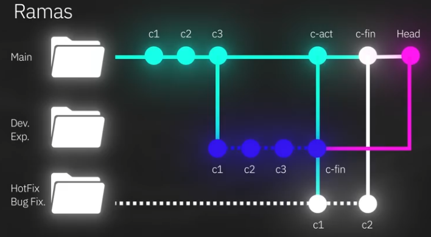

### 📋 Verificando la Rama Actual

Para ver en qué rama te encuentras, usa el siguiente comando:

```bash
git branch
```

Este comando listará todas las ramas del repositorio, y te indicará con un **asterisco** (`*`) la rama en la que estás trabajando actualmente.

### ➕ Creando una Nueva Rama

Para crear una nueva rama y cambiarte a ella de inmediato, usa:

```bash
git checkout -b nombre_rama
```

Por ejemplo, si creas una rama llamada **`josue`**, el comando será:

```bash
git checkout -b josue
```

Al ejecutar `git branch` después, verás que ahora estás en la rama **`josue`** en lugar de **`main`**.

### 📝 Trabajando en una Rama

Imagina que creas un archivo llamado **`test3.txt`** dentro de la carpeta **`practice/`** y lo añades al repositorio. Este cambio solo afectará a la rama **`josue`** y no se verá en **`main`**. Esto permite que cada rama sea independiente.

Para que los demás integrantes del equipo vean estos cambios, necesitas fusionar la rama **`josue`** con **`main`**. Para ello, primero regresa a la rama **`main`**:

```bash
git checkout main
```

O usa el comando alternativo:

```bash
git switch main
```

### 🔄 Fusionando las Ramas

Una vez en la rama **`main`**, fusiona los cambios de **`josue`** con:

```bash
git merge josue
```

Este comando fusionará las ramas utilizando un **Fast-forward**, lo que significa que los archivos modificados en **`josue`** se añadirán a **`main`** sin crear un commit adicional.

Para asegurarte de que la fusión fue exitosa, puedes revisar el historial de commits con:

```bash
git log
```

Esto te mostrará los commits en la rama **`main`**, asegurándote de que los cambios de **`josue`** se han integrado correctamente.

### 🗑️ Eliminar Ramas Después de Fusionarlas

Una vez que una rama individual haya cumplido su propósito y sus cambios se hayan fusionado con **`main`**, es una buena práctica eliminarla para evitar tener ramas innecesarias. Para eliminar la rama **`josue`**, usa:

```bash
git branch -D josue
```

Esto eliminará la rama **`josue`** de manera segura. El objetivo de las ramas es crearlas con un propósito específico y, una vez cumplido, eliminarlas para evitar conflictos en el futuro.

#### 🔄 Ejemplo de Flujo de Trabajo con Ramas

1. **Crear una nueva rama**:  
   `git checkout -b josue`
2. **Realizar cambios**:  
   Crear un archivo o modificar archivos.
3. **Añadir los cambios**:  
   `git add .`
4. **Hacer un commit**:  
   `git commit -m "Descripción del cambio"`
5. **Fusionar la rama con `main`**:  
   Cambiar a `main` (`git checkout main`) y hacer el merge (`git merge josue`).
6. **Eliminar la rama**:  
   `git branch -D josue`

## ⏪ Volver en el tiempo (Reset y Revert)

### 🔄 Git Revert

El comando **`git revert`** se utiliza para revertir los cambios de un commit específico y crear un nuevo commit que deshace esos cambios.

1. Primero, consulta el historial de commits con:

   ```bash
   git log
   ```

   En el historial, verás un commit marcado como **(HEAD -> main)**, lo que indica que es el último commit realizado y el puntero actual.

2. Supongamos que creas un archivo llamado **`error.txt`** en la carpeta **`practice/`** y lo subes al repositorio. El commit generado podría ser similar al siguiente:

   ```bash
   commit d36f1ecda1ccee7c29d3d20c095a22b3b6a91c24 (HEAD -> main)
   Author: JosueSay <106031855+JosueSay@users.noreply.github.com>
   Date:   Mon Dec 9 11:35:24 2024 -0600

       ft. archivo especial subido
   ```

3. Si decides que este archivo no debería estar en el repositorio, primero necesitas identificar el commit que lo introdujo, usando su hash (la cadena que aparece después de la palabra **commit**).

4. Luego, ejecuta el siguiente comando para revertir el commit:

   ```bash
   git revert d36f1ecda1ccee7c29d3d20c095a22b3b6a91c24
   ```

   Este comando abrirá un editor de texto donde podrás modificar el mensaje del commit, lo que se recomienda para indicar quién realizó el **revert**.

5. Al ejecutar `git log` nuevamente, verás un nuevo commit que revierte los cambios del commit con el hash indicado. Ten en cuenta que **`git revert` no elimina el commit original**, solo crea un nuevo commit que deshace los cambios realizados en el commit revertido.

6. Para verificar que el archivo **`error.txt`** ha sido eliminado, puedes usar `ls` en la carpeta **`practice`**. Si el archivo ya no aparece, significa que los cambios se han revertido correctamente.

### ⚡ Git Reset

El comando **`git reset`** permite mover el puntero de commits a un estado anterior, deshaciendo los commits posteriores.

1. Para ilustrar esto, creamos un archivo llamado **`reset.txt`** y lo subimos al repositorio. El historial de commits podría verse así:

   ```bash
   commit 08f5e06609bde67cea00bc19e4a464e0f9ee85db (HEAD -> main)
   Author: JosueSay <106031855+JosueSay@users.noreply.github.com>
   Date:   Mon Dec 9 11:48:49 2024 -0600

       Revert "ft. archivo especial subido" por Josué
       
       Correspondiente al commit con hash "d36f1ecda1ccee7c29d3d20c095a22b3b6a91c24"

   commit c4e383c481c883768a63ef093354b53245212e3f
   Author: JosueSay <106031855+JosueSay@users.noreply.github.com>
   Date:   Mon Dec 9 11:43:49 2024 -0600

       ft. cambios en documentación

   commit d36f1ecda1ccee7c29d3d20c095a22b3b6a91c24
   Author: JosueSay <106031855+JosueSay@users.noreply.github.com>
   Date:   Mon Dec 9 11:35:24 2024 -0600

       ft. archivo especial subido

   commit 8033ba076fc2c6655186bf482de10b81292f198e
   Author: JosueSay <106031855+JosueSay@users.noreply.github.com>
   Date:   Mon Dec 9 11:14:02 2024 -0600

       dc. Nueva documentación actualizada
   ```

2. Para hacer un **reset** a un commit anterior, toma el **hash** del commit antes de los cambios no deseados (por ejemplo, **`8033ba076fc2c6655186bf482de10b81292f198e`**).

3. Ejecuta el siguiente comando para realizar el **reset**:

   ```bash
   git reset --hard 8033ba076fc2c6655186bf482de10b81292f198e
   ```

   El parámetro **`--hard`** elimina tanto los **archivos** como el **historial de commits** posteriores al commit especificado, lo que puede afectar tanto a tu trabajo como al de otros si ya se han hecho cambios importantes.

4. Después de realizar el **reset**, el historial de commits se actualizará, y el puntero **HEAD** se moverá al commit especificado. Ejecuta `git log` para confirmar:

   ```bash
   commit 8033ba076fc2c6655186bf482de10b81292f198e (HEAD -> main)
   Author: JosueSay <106031855+JosueSay@users.noreply.github.com>
   Date:   Mon Dec 9 11:14:02 2024 -0600

       dc. Nueva documentación actualizada
   ```

#### Tipos de reset

| **Comando**                      | **Puntero HEAD**             | **Área de Staging**                             | **Directorio de Trabajo**                          | **¿Qué se pierde?**                                                     |
|-----------------------------------|------------------------------|-------------------------------------------------|---------------------------------------------------|-------------------------------------------------------------------------|
| **`git reset --soft <commit>`**   | Mueve a `<commit>`           | Los cambios posteriores al commit se mantienen en staging. | Los archivos no se modifican.                    | Los commits posteriores, pero los cambios están listos para un nuevo commit. |
| **`git reset --mixed <commit>`**  | Mueve a `<commit>`           | Los cambios posteriores se eliminan de staging.  | Los archivos se mantienen como están.             | Los commits posteriores, pero los cambios permanecen en el directorio de trabajo. Debes agregar los cambios a staging manualmente si quieres hacer commit de ellos. |
| **`git reset --hard <commit>`**   | Mueve a `<commit>`           | El área de staging se limpia.                   | Los archivos se restauran al estado del commit.   | Los commits posteriores y los cambios no comprometidos se pierden completamente. |

#### Resumen de los tipos de reset

- **`--soft`**: Mueve HEAD, conserva cambios en staging y en tu directorio de trabajo.
- **`--mixed`**: Mueve HEAD, limpia staging, pero mantiene los archivos modificados en tu directorio de trabajo.
- **`--hard`**: Mueve HEAD, limpia staging y elimina los cambios en el directorio de trabajo.

### 📌 Conclusión

- **`git revert`**: Crea un nuevo commit que deshace los cambios de un commit anterior, sin eliminar el historial. Ideal para deshacer cambios indeseados sin afectar a otros colaboradores.
- **`git reset`**: Deshace los commits y mueve el puntero de **HEAD** a un commit anterior. Usado principalmente para limpiar el historial de commits o regresar a un estado anterior del proyecto.

### 🛠️ ¿Cuándo usar cada uno?

- **Corrección de errores**: Si un archivo fue subido incorrectamente y necesitas revertirlo, **`git revert`** es la mejor opción. Si varios colaboradores necesitan revertir sus cambios, **`git reset`** puede ser más adecuado.
- **Limpieza del historial**: Cuando tienes un historial largo con muchos commits irrelevantes, puedes usar **`git reset`** para limpiar el historial de forma más drástica.
- **Manejo de conflictos entre ramas**: Si no puedes resolver un conflicto entre ramas, un **`git reset`** podría ser útil para regresar a un punto funcional del proyecto.

> **Nota**: El uso de **`git reset --hard`** debe ser la última opción, ya que puede causar pérdida de trabajo si no se usa correctamente.

## 🛠️ Documentación Integrada: **Uso de Git Tag y Checkout**

### 🏷️ **Git Tag**

El comando `git tag` se utiliza para asignar etiquetas a los commits, facilitando su identificación en el futuro. Las etiquetas son útiles para marcar **versiones específicas** de un proyecto o **hitos importantes** en el historial de commits.

#### 🚀 **Uso básico:**

1. **Crear una etiqueta:**  
   Para asignar una etiqueta a un commit reciente:

   ```bash
   git tag -a v1.0 -m "Mi primera versión"
   ```

   - `-a v1.0`: Crea una etiqueta con el nombre "v1.0".
   - `-m "Mi primera versión"`: Mensaje descriptivo para la etiqueta.

2. **Ver etiquetas existentes:**  
   Muestra todas las etiquetas del repositorio:

   ```bash
   git tag
   ```

3. **Obtener detalles de una etiqueta:**  
   Para ver información detallada del commit asociado a una etiqueta:

   ```bash
   git show <etiqueta>
   ```

4. **Eliminar una etiqueta:**  
   Borra una etiqueta localmente sin afectar el historial:

   ```bash
   git tag -d <etiqueta>
   ```

#### 📝 **Ejemplo práctico:**

Si tienes el siguiente commit:

```bash
commit dc6fff31021852d394873ff869dd9a8d682bedb0 (HEAD -> main)
Author: JosueSay <106031855+JosueSay@users.noreply.github.com>
Date:   Mon Dec 9 12:37:13 2024 -0600

    dc. documentación sobre reset y revert
```

Puedes etiquetarlo como "v1.0":

```bash
git tag -a v1.0 -m "Mi primera versión"
```

Esto permite identificar este commit fácilmente en el futuro al ejecutar `git tag`.

---

### 🔄 **Git Checkout**

El comando `git checkout` permite cambiar entre **ramas** o explorar un **commit específico** sin modificar la rama principal. Esto es útil para evaluar cambios o realizar pruebas en puntos específicos del historial.

#### 🔍 **Cambiar a un commit específico:**

1. **Identifica el hash del commit** que deseas explorar:

   ```bash
   git log
   ```

2. **Cambia a ese commit:**

   ```bash
   git checkout <hash>
   ```

   Esto moverá tu `HEAD` al commit especificado, colocándote en un estado de **HEAD detached**.

#### 🔙 **Regresar a la rama principal:**

Después de explorar, vuelve al estado actual de la rama principal con:

```bash
git checkout main
```

#### 💡 **Ejemplo práctico:**

Imagina este historial de commits:

```bash
commit f3e384197dec8e2f611d3fa79512aec484f020e9 (HEAD -> main)
Author: JosueSay <106031855+JosueSay@users.noreply.github.com>
Date:   Mon Dec 9 21:15:25 2024 -0600

    dc. pre documentación de checkout

commit dc6fff31021852d394873ff869dd9a8d682bedb0 (tag: v1.0)
Author: JosueSay <106031855+JosueSay@users.noreply.github.com>
Date:   Mon Dec 9 12:37:13 2024 -0600

    dc. documentación sobre reset y revert
```

Para explorar el segundo commit:

```bash
git checkout dc6fff31021852d394873ff869dd9a8d682bedb0
```

Esto mostrará:

```bash
HEAD detached at dc6fff3
```

Puedes realizar pruebas en este estado. Una vez terminado, vuelve a la rama principal:

```bash
git checkout main
```

#### ⚠️ **Notas importantes:**

- Los cambios realizados en el estado de **HEAD detached** no se reflejarán en ninguna rama, a menos que los guardes explícitamente.
- Si deseas conservar los cambios, crea una nueva rama:

  ```bash
  git switch -c <nombre-nueva-rama>
  ```

### ✅ **Conclusión:**

- **🏷️ Git Tag:** Ideal para marcar puntos importantes en el historial de commits, como versiones de software.
- **🔄 Git Checkout:** Perfecto para explorar y probar cambios en commits específicos sin afectar la rama principal.

## ⚔️ Resolución de Conflictos en Git

Los **conflictos** en Git ocurren cuando dos o más desarrolladores modifican el mismo archivo y se intenta fusionar las ramas que contienen estos cambios. Git no puede decidir automáticamente qué modificaciones conservar, por lo que requiere intervención manual para resolver el conflicto.

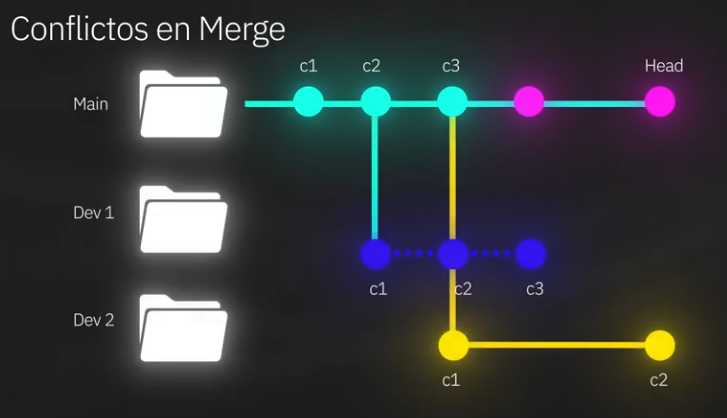

### 🛠️ Reproduciendo un Conflicto

1. **Crear un archivo base:**  
   Creamos un archivo llamado **`conflict.txt`**, añadimos contenido inicial y guardamos los cambios en Git:

   ```bash
   echo "Línea original" > practice/conflict.txt
   git add .
   git commit -m "Agregar archivo conflict.txt"
   ```

2. **Generar cambios en ramas distintas:**

   - Creamos una nueva rama llamada **`developer`**:

     ```bash
     git checkout -b developer
     ```

   - Modificamos el archivo **`conflict.txt`**, añadimos y guardamos los cambios:

     ```bash
     echo "cambios desde la rama developer" >> practice/conflict.txt
     git add .
     git commit -m "Cambios desde developer"
     ```

   - Volvemos a la rama **`main`** y realizamos otros cambios en el mismo archivo:

     ```bash
     git checkout main
     echo "segundo cambio desde main" >> practice/conflict.txt
     git add .
     git commit -m "Cambios desde main"
     ```

3. **Intentar fusionar las ramas:**  
   Cuando intentamos fusionar **`developer`** con **`main`**, Git detecta un conflicto:

   ```bash
   git merge developer
   ```

   Resultado en la terminal:

   ```bash
   Auto-merging practice/conflict.txt
   CONFLICT (content): Merge conflict in practice/conflict.txt
   Automatic merge failed; fix conflicts and then commit the result.
   ```

### 🧐 Analizando el Conflicto

Al abrir el archivo **`conflict.txt`**, veremos una marca especial que indica el conflicto:

```txt
Línea original

<<<<<<< HEAD
segundo cambio desde main
=======
cambios desde la rama developer
>>>>>>> developer
```

- **`HEAD`**: Representa los cambios en la rama **`main`**.
- **`developer`**: Representa los cambios en la rama **`developer`**.

### ✅ Resolviendo el Conflicto

1. Decide cuál contenido conservar o si es necesario fusionar ambos cambios manualmente.
2. Edita el archivo para dejar únicamente el contenido deseado. Por ejemplo:

   ```txt
   Línea original

   segundo cambio desde main
   cambios desde la rama developer
   ```

3. Guarda el archivo después de resolver el conflicto.

4. Marca el conflicto como resuelto y realiza el commit:

   ```bash
   git add practice/conflict.txt
   git commit -m "Resolver conflicto en conflict.txt"
   ```

### 📋 Verificando la Resolución

Puedes verificar el estado del repositorio antes y después de resolver el conflicto con:

```bash
git status
```

Antes de resolver:

```txt
On branch main
You have unmerged paths.
  (fix conflicts and run "git commit")
  (use "git merge --abort" to abort the merge)

Unmerged paths:
  (use "git add <file>..." to mark resolution)
        both modified:   practice/conflict.txt
```

Después de resolver:

```txt
On branch main
All conflicts fixed but you are still merging.
  (use "git commit" to conclude merge)
```

### 🗑️ Eliminando Ramas Innecesarias

Una vez que los cambios se han fusionado y el conflicto está resuelto, elimina la rama para evitar conflictos futuros:

```bash
git branch -D developer
```

### 📝 Notas Adicionales

- Si te sientes perdido durante el proceso de resolución, puedes **abortar el merge** con:

  ```bash
  git merge --abort
  ```

- Usa `git log` para verificar que el último commit incluye los cambios fusionados de ambas ramas:

  ```bash
  git log
  ```

## 🌐 GitHub  

Existen distintas herramientas para alojar un control de versiones, como **Atlassian**, **GitLab**, etc., pero una herramienta clave es **GitHub**, lanzada en febrero de 2008. Dos años después, fue adquirida por **Microsoft**.  

GitHub ha evolucionado considerablemente: inicialmente solo servía para alojar repositorios, pero ahora se ha transformado en un sitio web que funciona como una **red social para programadores**. Además, GitHub incorpora inteligencia artificial para construir, escalar y entregar código seguro bajo **cuatro pilares fundamentales** dentro de **GitHub Enterprise**:  

### 🔑 **Pilares de GitHub Enterprise**

1. **🤖 Inteligencia Artificial:**  
   Mejora la colaboración, la seguridad y la productividad en el desarrollo.  

2. **🤝 Colaboración:**  
   Acelera el trabajo en equipo y la entrega de proyectos.  

3. **⚡ Productividad:**  
   Automatiza tareas rutinarias, permitiendo que los desarrolladores se concentren en crear soluciones innovadoras.  

4. **🔒 Seguridad y Escalabilidad:**  
   Desde el principio, GitHub integra código seguro y adapta la plataforma para manejar un gran número de usuarios.  

### 🚀 **Un espacio para contribuir**

GitHub permite contribuir de manera colaborativa al desarrollo de proyectos, como el **kernel de Linux**. Es una herramienta que fomenta la participación de la comunidad global en la construcción de software de alta calidad.

## 🧑‍💻 Creación y Configuración de una Cuenta en GitHub  

GitHub es una herramienta poderosa para alojar y colaborar en proyectos de desarrollo. Aquí te mostramos cómo crear y configurar tu cuenta de manera segura:  

### ✨ **Creación de la cuenta**

1. 🌐 **Accede a GitHub:** Ve a [github.com](https://github.com) y haz clic en **"Sign up"**.  
2. 📧 **Correo electrónico:** Ingresa tu correo electrónico y selecciona **"Continuar"**.  
3. 🔒 **Contraseña:** Crea una contraseña segura y presiona **"Continuar"**.  
4. 🏷️ **Nombre de usuario:** Elige un nombre único y verifica su disponibilidad.  
5. ✅ **Verificación humana:** Completa el captcha.  
6. ✉️ **Código de verificación:** Recibirás un código en tu correo; introdúcelo en el sitio.  
7. 📝 **Cuestionario:** Completa las preguntas sobre tu perfil para personalizar tu experiencia.  
8. 💸 **Selecciona el tipo de cuenta:** Te recomendamos la opción **gratuita** para comenzar.  

### 🛠️ **Configuración del perfil**

1. 🔧 Ve a **Settings** en tu perfil.  
2. ✍️ Personaliza tu información, como nombre, biografía y enlaces.  
3. 🔐 **Habilita la verificación en dos pasos** para mayor seguridad:  
   - **Nunca uses SMS** como método de autenticación.  

### 📱 **Configuración de la autenticación en dos pasos**

1. 📲 Descarga la aplicación de **GitHub** en tu teléfono o utiliza apps de autenticación como **Google Authenticator** o **Authy**.  
2. 🔑 Ve a **"Settings" > "Password and Authentication"** en el sitio web de GitHub.  
3. 📷 Haz clic en **"Habilitar autenticación en dos pasos"**.  
4. 🖼️ Escanea el **código QR** mostrado en pantalla con tu aplicación de autenticación.  
5. 🔢 Introduce el código generado por la aplicación para completar el proceso.  
6. 🗂️ **Guarda los códigos de recuperación:**  
   - GitHub proporcionará una lista de códigos de respaldo.  
   - **Descárgalos y guárdalos** en un lugar seguro; estos te ayudarán a recuperar el acceso si pierdes tu dispositivo de autenticación.  

## 🔗 Integración de Git y GitHub  

Aunque **Git** y **GitHub** son herramientas diferentes, se pueden vincular para trabajar en equipo y gestionar proyectos de forma eficiente.  

  

---

### 🛠️ **Crear un repositorio**  

1. Ve a la opción del ícono de **"+"** en la parte superior derecha.  
     

2. Llena el formulario para crear el repositorio:  
   - **Nombre del repositorio.**  
   - **Descripción:** Explica el propósito del proyecto.  
   - **Visibilidad:** Selecciona si será **público** o **privado**.  
   - **Inicializar con un README:** Recomendado para documentar el proyecto.  
   - **GitIgnore:** Excluye archivos específicos según el lenguaje o herramienta.  
   - **Licencia:** Define los permisos y restricciones de uso del código.  

   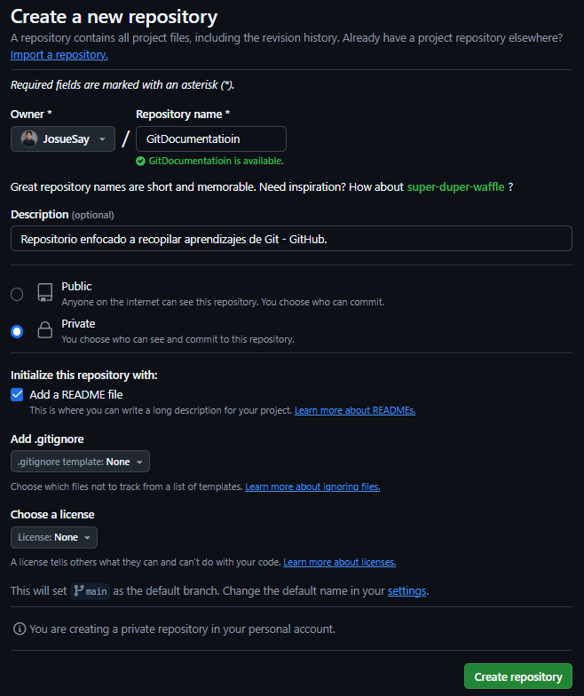  

3. **Crear el repositorio:**  
   Haz clic en el botón para finalizar la creación.  

---

### 👥 **Agregar colaboradores**  

1. Ve a **"Settings"** en el repositorio.  
2. En la sección de **"Collaborators"**, agrega personas como colaboradores (estas personas deben tener una cuenta de GitHub).  
3. El colaborador recibirá una invitación que debe aceptar para poder colaborar en el proyecto.  

   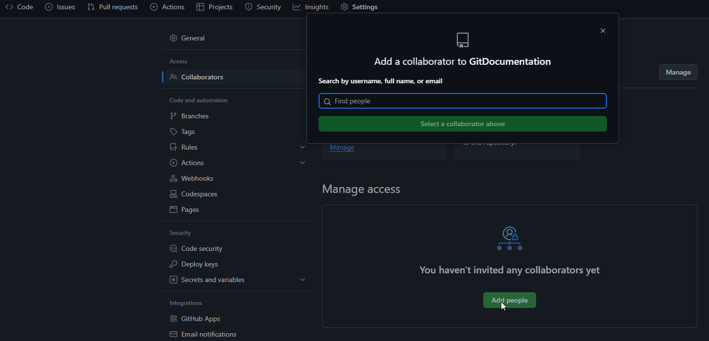  

---

### 🌐 **Clonar el repositorio**  

En el repositorio encontrarás una rama principal llamada **main**. Para trabajar localmente, puedes clonar el repositorio usando el botón **"Code"**, eligiendo entre tres opciones:

- 🌍 **HTTPS.**
- 🔒 **SSH.**  
- 💻 **GitHub CLI.**  

#### **Clonar usando HTTPS:**

1. Copia la URL proporcionada, por ejemplo:

   ```plaintext
   https://github.com/JosueSay/GitDocumentation.git
   ```

2. En la terminal, ejecuta el comando:

   ```bash
   git clone <url>
   ```  

   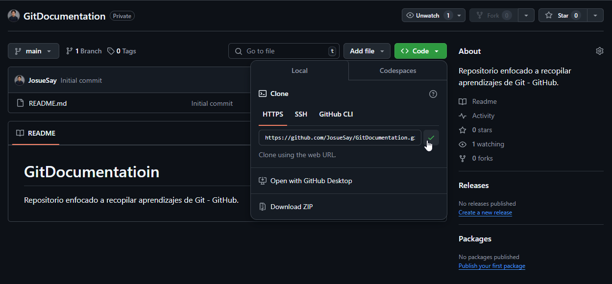  

3. Una vez clonado, verás que el repositorio aparece como una carpeta en tu equipo. Dentro de esta carpeta, encontrarás archivos como el `README.md`.  
4. Adicional se agrega una pagina para ver los [Planes de GitHub](https://github.com/pricing "Planes de GitHub") y comparar precios.

### 🔗 Fusionar entorno local y remoto  

Para unificar tu entorno local de Git con un repositorio remoto en GitHub, puedes usar el siguiente comando:  

```bash
git remote add origin <URL_DEL_REPOSITORIO_REMOTO>
```  

#### Pasos

1. **Agregar el repositorio remoto:**  
   Reemplaza `<URL_DEL_REPOSITORIO_REMOTO>` con la URL de tu repositorio en GitHub. Esto vincula tu repositorio local con el remoto.  

2. **Verificar la conexión:**  
   Usa el comando:

   ```bash
   git remote -v
   ```

   Esto mostrará las URLs configuradas para las conexiones remotas. Verifica que la URL listada coincida con la del repositorio remoto que quieres usar.  

## 🔐 Configuración de llaves SSH en GitHub  

Configurar una llave SSH en GitHub permite que una computadora específica se conecte a tu cuenta sin necesidad de ingresar la contraseña en cada operación, facilitando el trabajo.  

  

---

### 🐧 **Configuración en WSL - Linux**  

#### Paso 1: **Intentar clonar con SSH**

- Ve al repositorio anterior.  
- Selecciona la opción **SSH** en el botón **Code**.  
- Si no tienes una llave pública configurada, aparecerá un mensaje indicándolo.  

---

#### Paso 2: **Generar una llave SSH**

Ejecuta el siguiente comando en tu terminal para crear una nueva llave:  

```bash
ssh-keygen -t ed25519 -C "tu_correo@gmail.com"
```  

Durante el proceso:

1. 📝 **Nombre:** Te pedirá un nombre para la llave (puedes dejarlo en blanco para usar el predeterminado).  
2. 🔑 **Contraseña:** Introduce y confirma una contraseña para la llave.  
3. ✅ **Confirmación:** Una vez creada, recibirás un mensaje indicando su éxito.  

---

#### Paso 3: **Activar el agente SSH**

Para verificar y activar el agente SSH, usa este comando:  

```bash
eval "$(ssh-agent -s)"
```  

Luego, agrega la llave privada al agente para evitar ingresar la contraseña constantemente:  

```bash
ssh-add ~/.ssh/private_name_key
```  

Te pedirá la contraseña configurada anteriormente. Una vez ingresada, recibirás una confirmación de que la identidad se agregó exitosamente.  

---

#### Paso 4: **Copiar la llave pública**

Abre y copia el contenido de la llave pública:  

```bash
cat ~/.ssh/private_name_key.pub
```  

---

#### Paso 5: **Configurar la llave en GitHub**

1. 🌐 Ve a tu perfil en GitHub.  
2. ⚙️ En **Settings**, busca la sección **SSH and GPG Keys**.  
3. ➕ Agrega una nueva llave SSH:  
   - **Título:** Nombre de tu computadora (por ejemplo, "Laptop-Personal").  
   - **Contenido:** Pega la llave pública copiada anteriormente.  
4. Haz clic en **Add SSH Key** para guardar la configuración.  

---

#### Paso 6: **Probar la conexión SSH**

En la terminal, ejecuta el siguiente comando para confirmar que la llave está vinculada correctamente:  

```bash
ssh -T git@github.com
```  

Si todo está configurado correctamente, verás un mensaje de bienvenida como este:  

```plaintext
Hi JosueSay! You've successfully authenticated, but GitHub does not provide shell access.
```  

---

### 📝 **Notas importantes**

- 🔑 Genera llaves SSH para cada computadora que utilices.  
- 🚫 **Nunca compartas tus llaves privadas.**  
- 🎉 Ahora puedes clonar repositorios usando SSH.  

## ⭐ Clone, Fork y Estrella en repositorios  

Estos son botones comunes que encontrarás en los repositorios de otras cuentas en GitHub.  

  

---

### 🍴 **Fork**  

Un **fork** crea una copia de un repositorio de otra cuenta en tu propia cuenta.  

#### Características clave

- Una vez copiado en tu cuenta, el repositorio "forkeado" **queda congelado**.  
- Si el repositorio original recibe actualizaciones, **no se reflejarán automáticamente** en tu copia.  
- Permite trabajar en un proyecto sin alterar el repositorio original.  

Esto lo diferencia de clonar un repositorio directamente, ya que el fork es una copia independiente en tu cuenta.  

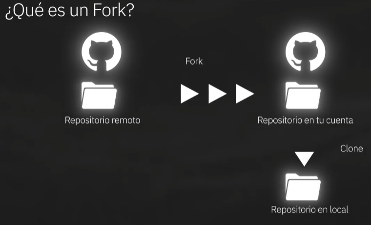  

---

### ⭐ **Estrella**  

La estrella es una forma de marcar tus repositorios favoritos en GitHub.  

#### Cómo utilizarla

1. Haz clic en el botón **Star** en cualquier repositorio que quieras destacar.  
2. Para ver todos tus repositorios marcados con estrella:  
   - Ve a tu perfil.  
   - Selecciona la opción **Your Stars** en el menú.  

## 🌐 Trabajar con Repositorios Remotos

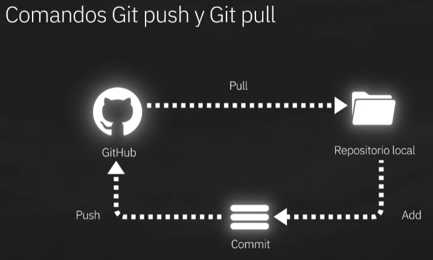

### 📤 Git Push

**Sube el contenido del repositorio local al repositorio remoto.**  

Para sincronizar los cambios hechos en tu entorno local, puedes usar **Visual Studio Code**. Una vez que hayas guardado los cambios en tu entorno local, VS Code puede subir automáticamente los cambios al repositorio remoto.

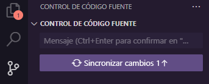

También puedes hacerlo desde la terminal usando el siguiente comando:

```bash
git push -u origin main
```

Aquí, el flag `-u` establece que la rama remota **origin/main** será la rama por defecto para los futuros `git push`. Esto te permite usar simplemente:

```bash
git push
```

Aunque si existe una rama `main` en el repositorio remoto, Git subirá los cambios a esta rama de todos modos si omites el `-u origin main`. Sin embargo, por seguridad, es recomendable usar el comando completo.

---

### 📥 Git Pull

**Obtén el contenido actualizado del repositorio remoto y actualiza tu repositorio local.**  

Imagina que alguien más editó el archivo **README.md** en el repositorio remoto. Puedes ver esos cambios editando directamente en la web y haciendo el commit desde allí:

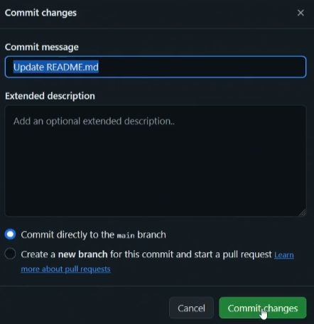

Una vez realizado el commit, los cambios aparecerán reflejados en la interfaz de **VS Code** con una flecha hacia abajo, lo que indica que hay actualizaciones para sincronizar:


Puedes actualizar tu repositorio local con el siguiente comando:

```bash
git pull
```

Este comando traerá las actualizaciones desde la rama `main` del repositorio remoto por defecto. Ten en cuenta que **no puedes hacer un `git push` si el repositorio remoto no está sincronizado con tu repositorio local**. Siempre debes realizar un `git pull` antes de hacer un `git push`.

---

### 📥 Git Fetch

**Obtén los cambios del repositorio remoto sin fusionarlos automáticamente con tu repositorio local.**  

Si has hecho cambios en el repositorio remoto desde la web, puedes comprobar el estado de tu repositorio con:

```bash
git status
```

Si no hay cambios locales que necesiten ser subidos, puedes usar el siguiente comando para obtener los cambios desde el repositorio remoto sin fusionarlos automáticamente:

```bash
git fetch origin
```

A diferencia de `git pull`, `git fetch` solo descarga los cambios, pero no los fusiona inmediatamente. Esto te permite revisar qué cambios han sido realizados antes de decidir si deseas aplicarlos.

Para ver los cambios, puedes usar el siguiente comando:

```bash
git log main..origin/main
```

Esto te mostrará los commits del repositorio remoto que aún no se han aplicado en tu repositorio local. Ejemplo:

```plaintext
commit fd360f6b6b73a3ef37d42e51bdc4d423d495190a (origin/main)
Author: Josué Say <106031855+JosueSay@users.noreply.github.com>
Date:   Wed Dec 11 11:57:42 2024 -0600

    Update README.md
```

Si decides que deseas aceptar esos cambios, puedes fusionarlos con el siguiente comando:

```bash
git merge origin/main
```

Esto fusionará la rama remota con la local, permitiéndote decidir si deseas aceptar o no esos cambios.

## 📝 Gestión de Issues y Discusiones

Los **issues** son tickets de seguimiento que permiten rastrear tareas, errores y solicitudes dentro de un proyecto. Se utilizan para notificar al autor sobre fallos, problemas o ideas de mejora, facilitando el control de lo que se necesita resolver en el proyecto.

### 🛠️ Crear un Issue

Para crear un issue, simplemente dirígete al apartado de **Issues** en tu repositorio y llena el formulario con la siguiente información:

- **Título** del issue
- **Descripción** detallada del problema o tarea
- **Etiquetas** y **asignación** (si es necesario)

Con esta forma básica, puedes contribuir a mejorar el código y gestionar los problemas de manera eficiente. Además, en el apartado de **Issues** podrás ver cuántos problemas han sido reportados, indicados por números.


### 📝 Plantilla para Issues

Si deseas facilitar la creación de issues para las personas que colaboran en tu proyecto, puedes crear una **plantilla** para que sigan un formato específico. Para ello, crea una carpeta `.github/ISSUE_TEMPLATE` en tu repositorio, y dentro de ella, crea un archivo `bug_report.md`.

Esto permitirá que los colaboradores utilicen una plantilla predefinida cada vez que quieran reportar un error, lo que hará que los issues sean más claros y organizados.

El objetivo de esta plantilla es simplificar el proceso de reporte de bugs y ayudar a las personas a describir los problemas de manera clara y estructurada. Así, cualquier persona que desee reportar un **issue** podrá habilitar la plantilla de **Bug Report** y proporcionar la información necesaria para su resolución.


## 🔄 Pull Request

Cuando trabajas de manera colaborativa en un proyecto, es crucial evitar sobrescribir los cambios de otros sin querer. Si bien es posible subir cambios directamente a la rama **main**, esto puede ocasionar la pérdida de cambios no sincronizados con el equipo. Para evitarlo, se recomienda trabajar en **ramas separadas** y, después, combinar esos cambios en una **revisión previa** utilizando **pull requests**.

Un **pull request** (PR) es una notificación que se envía al equipo, informando sobre los cambios realizados en una rama específica. Cualquier miembro del equipo puede revisar esos cambios, un proceso conocido como **code review**. Una vez que los cambios son aprobados por el equipo, el PR se cierra y los cambios se fusionan con la rama **main**.

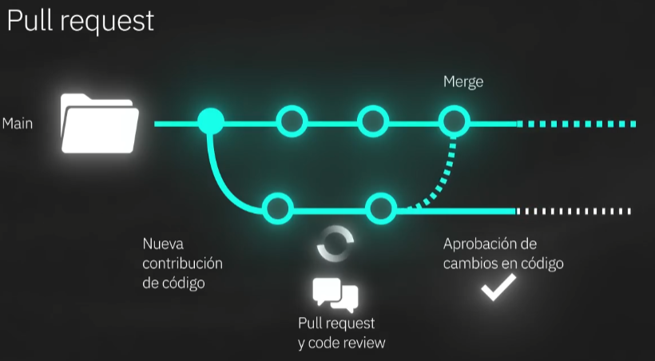

### ✅ Buen hábito: Crear ramas para trabajar

Un buen hábito es crear una **rama** dedicada para cada tarea o conjunto de cambios. Por ejemplo, al editar el **README**, es recomendable:

1. Crear una nueva rama para trabajar en los cambios.
2. Realizar los cambios en el entorno local.
3. Subir esos cambios tanto al repositorio local como remoto utilizando el comando **git push** hacia la rama recién creada.

### 📝 Crear el Pull Request

Una vez que los cambios están listos y sincronizados, dirígete al repositorio en GitHub, selecciona la rama creada y haz clic en el botón **"Pull Request"**. Aquí, deberás:

- Colocar un **título** claro y descriptivo del PR.
- Escribir una **descripción detallada** de los cambios realizados en ese código.

Recuerda ser lo más detallado posible para facilitar la revisión del equipo.

Luego de crear el PR, GitHub verificará si existen **conflictos** entre las ramas. El siguiente paso es esperar a que un miembro del equipo valide el PR. Si el código es aprobado, se **fusionará** con la rama **main**. Finalmente, se eliminará la rama de trabajo una vez que el PR haya sido completado y fusionado.

## 🗂️ GitHub Projects

**GitHub Projects** es una herramienta diseñada para la **planificación y seguimiento de trabajo** en GitHub, ideal para equipos que desean organizar tareas y mejorar su flujo de trabajo.

### 🌟 Creación de Proyectos

1. En tu perfil, selecciona la pestaña **Projects** en el encabezado.
2. Crea un nuevo proyecto y elige entre distintas **plantillas** predefinidas como:
   - **Kanban**: Perfecto para organizar tareas en columnas.
   - **Team Planning**: Ideal para gestionar la planificación de equipos.

Al usar estas plantillas, puedes definir detalles como:

- **Tamaño de la tarea**
- **Estimaciones de tiempo**
- **Iteraciones**
- **Asignaciones de equipo**

Los proyectos también pueden vincularse a repositorios para un seguimiento más integrado.

### 📝 Tareas y Vinculación con Issues

- Las tareas dentro de un proyecto pueden comenzar como un **draft**, lo que significa que no están vinculadas a ningún repositorio.
- Puedes convertir un draft en un **Issue** y vincularlo a un repositorio específico.
- A partir de dicho Issue, es posible generar una rama con el nombre del Issue para trabajar en la actividad.

### 🔗 Integración con Issues y Pull Requests

Las tareas vinculadas a un proyecto aparecerán como **Issues** en el repositorio correspondiente. Una vez completadas, pueden convertirse en un **Pull Request (PR)** para revisión y fusión.

Esta integración permite:

- **Vincular múltiples proyectos** a un mismo Issue.
- Supervisar actividades relacionadas en diversos proyectos de manera simultánea.

### 🚀 Flujo de Trabajo Recomendado

1. **Crear un Issue** desde el proyecto, asegurándote de vincularlo al repositorio adecuado.
2. Abrir una rama basada en el Issue para trabajar en la solución.
3. Resolver la actividad y realizar un PR para integrar los cambios en la rama principal.
4. Monitorear el progreso desde el tablero del proyecto.

## 🤖 Automatización y Gestión de Proyectos

GitHub proporciona una herramienta poderosa para la colaboración en equipo a través de **Proyectos**. Con esta funcionalidad, puedes gestionar tareas, medir métricas y optimizar el flujo de trabajo de tus repositorios.

### 🚀 Crear un Proyecto

1. Ve a tu perfil de GitHub y selecciona la pestaña **Projects**.
2. Haz clic en **"Nuevo proyecto"**.
3. Configura los detalles del proyecto, como:
   - **Nombre del proyecto**
   - **Descripción**
   - **Visibilidad** (público o privado)

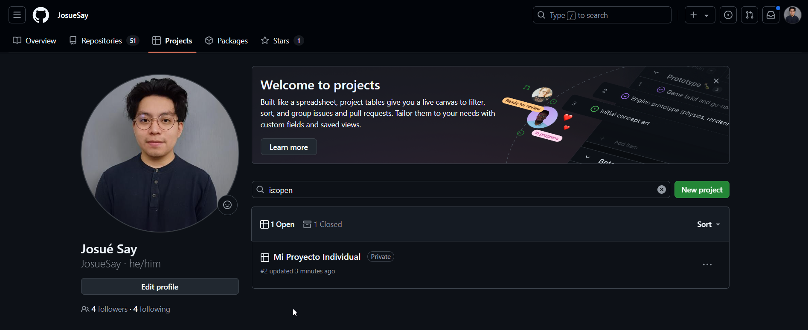

### 🔗 Enlazar un Proyecto a un Repositorio

Para integrar un proyecto con un repositorio específico:

1. Dirígete al repositorio en GitHub.
2. En el encabezado, selecciona la pestaña **Projects**.
3. Enlaza el repositorio al proyecto creado previamente. Esto asegurará que las tareas estén alineadas con el repositorio correspondiente.

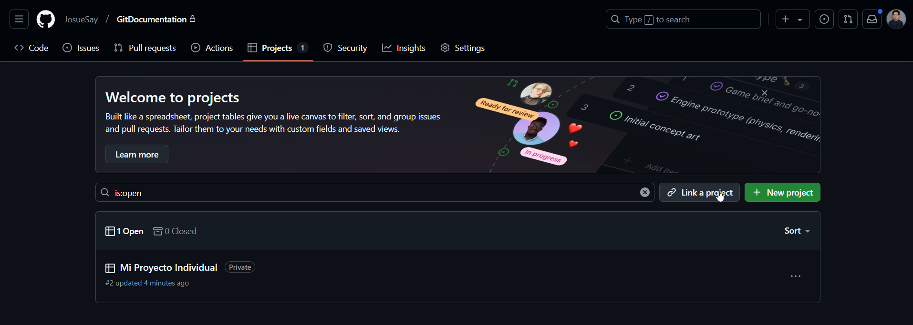

### 🛠️ Funcionalidades del Proyecto

Una vez configurado, dentro del proyecto puedes:

- Crear y organizar **tableros de tareas**.
- Acceder a **insights** para analizar métricas y el progreso.
- Ajustar el flujo de trabajo para las diferentes actividades.

### 📝 Automatización con Issues y Pull Requests

Un uso práctico de los proyectos es la vinculación de **issues** con actividades específicas. Puedes automatizar el cierre de un issue cuando completes un pull request (PR) utilizando palabras clave.

Por ejemplo, en la descripción de un PR, escribe:

```plaintext
Closes #<número del issue>
```

Esto asegura que el issue se cerrará automáticamente cuando el PR sea fusionado, manteniendo el proyecto actualizado sin esfuerzo adicional.

## 📝 Markdown

**Markdown** es un lenguaje de marcado que permite generar documentos de manera sencilla utilizando una sintaxis ligera, como ocurre con HTML o XML.

---

### 🔤 Títulos

Los títulos se crean usando el carácter `#` seguido del texto. El número de `#` determina el nivel del título:

```markdown
# Título 1
## Título 2
### Título 3
```

---

### 💬 Comentarios

Para agregar comentarios en Markdown se usa la siguiente sintaxis:

```html
<!-- Esto es un comentario -->
<!-- Para abrir el preview en algunos editores como VSCode, presiona F1 y busca Markdown Preview -->
<!-- Los saltos de línea se generan con un Enter -->
```

---

### ✏️ Estilizado de Texto

- *Itálica*:  
  `*Texto en itálica*` → *Texto en itálica*
- **Negrita**:  
  `**Texto en negrita**` → **Texto en negrita**
- ~~Tachado~~:  
  `~~Texto tachado~~` → ~~Texto tachado~~

---

### 📋 Listas

**Listas sin orden:**

```markdown
- Item 1
  - SubItem 1.1
- Item 2
```

- Item 1
  - SubItem 1.1
- Item 2

**Listas ordenadas:**

```markdown
1. Item 1
   1. SubItem 1
2. Item 2
```

1. Item 1  
   1. SubItem 1  
2. Item 2  

---

### 🔗 Enlaces

- Básico:  
  `[Google](https://www.google.com/)` → [Google](https://www.google.com/)

- Con descripción emergente:  
  `[Google](https://www.google.com/ "Buscador de Google")` → [Google](https://www.google.com/ "Buscador de Google")

---

### 🗨️ Citas

Para agregar citas, usa el símbolo `>` al inicio de la línea:

```markdown
> "Esto es una cita"
```

> "Esto es una cita"

---

### 📄 Separador de Líneas

Para separar secciones, utiliza tres guiones (`---`):

```markdown
---
```

---

### 🖥️ Código

- **Línea de código**:  
  `` `print('Hola Mundo')` `` → `print('Hola Mundo')`

- **Bloque de código**:

  ```markdown
  def miFuncion():
      print('Hola Mundo')
  ```
  
  ```python
  def miFuncion():
      print('Hola Mundo')
   ```

---

### 📊 Tablas

```markdown
| Encabezado 1 | Encabezado 2 | Encabezado 3 |
| ------------ | ------------ | ------------ |
| Item 1       | Item 2       | Item 3       |
| Item 4       | Item 5       | Item 6       |
```

| Encabezado 1 | Encabezado 2 | Encabezado 3 |
| ------------ | ------------ | ------------ |
| Item 1       | Item 2       | Item 3       |
| Item 4       | Item 5       | Item 6       |

---

### 🖼️ Imágenes

- Desde URL:

  ```markdown
  
  ```

  

- Desde archivo local:

  ```markdown
  
  ```

---

### ✅ Tareas (Checklists)

Requiere un plugin como **Markdown Checkboxes**:

```markdown
- [x] Tarea 1
- [ ] Tarea 2
```

- [x] Tarea 1  
- [ ] Tarea 2  

---

### 👥 Menciones

Para mencionar a un usuario:

```markdown
@username
```

Ejemplo: @github

---

### 📈 Diagramas Mermaid

Con soporte de **Markdown Preview Mermaid Support**:

```mermaid
graph TD;
    A-->B;
    A-->C;
    B-->D;
    C-->D;
```

```mermaid
---
title: Git Flow Diagram
---
gitGraph
    commit
    commit
    branch develop
    checkout develop
    commit
    commit
    checkout main
    merge develop
    commit
```

---

### 😃 Emojis

Usa la sintaxis de GitHub para emojis:

`:+1:` → 👍  
`:smiley:` → 😃

Lista completa: [GitHub Emoji Cheat Sheet](https://gist.github.com/rxaviers/7360908)

---

### 🧮 Matemáticas

Utiliza sintaxis LaTeX para ecuaciones:

```markdown
$$
E = mc^2
$$
```

$$
E = mc^2
$$

### 📚 Recursos adicionales

Para más información, consulta la [Documentación Markdown](https://github.com/adam-p/markdown-here/wiki/Markdown-Cheatsheet "Documentación Markdown").

## 🎨 Personalizar Perfil de GitHub

Con **Markdown**, es posible crear una portada personalizada para el perfil de tu GitHub. Esto se hace a través de un repositorio especial vinculado a tu nombre de usuario.

### 📂 Crear el repositorio especial  

1. **Crea un repositorio con el mismo nombre de tu usuario:**  
   Al hacerlo, GitHub indicará que este es un "repositorio especial" que se vinculará automáticamente a tu perfil.

   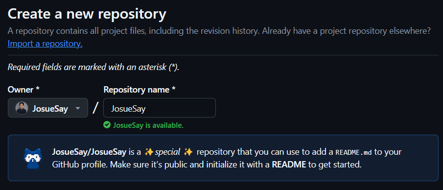

2. **Portada personalizada:**  
   Una vez creado, el archivo `README.md` dentro de este repositorio aparecerá como portada de tu perfil.  

   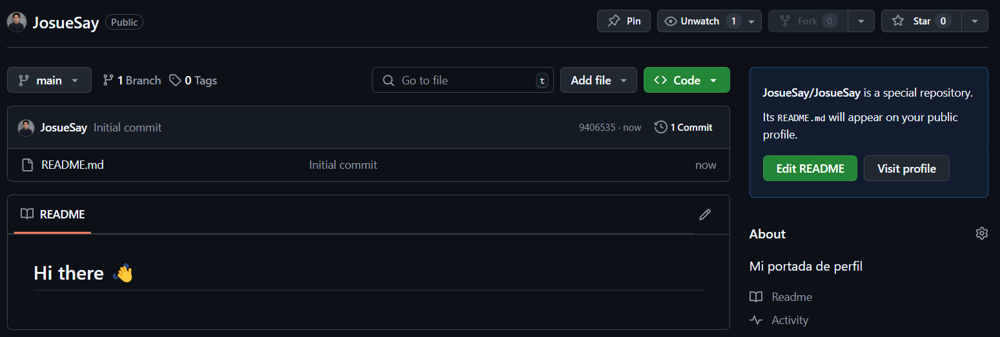

### 🛠️ Configuración del repositorio  

1. **Clona el repositorio:**  
   Usa el comando `git clone` para trabajar con el repositorio de forma local.

2. **Edita el archivo `README.md`:**  
   Sigue la estructura de comentarios sugerida para personalizar tu biografía o presentación.  

### 🎉 Personaliza tu README  

Usa Markdown para agregar contenido único, como:  

- **Descripción de tu perfil:**  
  Escribe una biografía breve con tus intereses y logros.  

- **Badges personalizados:**  
  Genera insignias en [shields.io](https://shields.io/badges/static-badge "shields.io") para destacar tus tecnologías favoritas o logros.  

  Ejemplo:

  ```markdown
  
  ```

  

- **Iconos personalizados:**  
  Encuentra iconos en [Simple Icons](https://simpleicons.org/ "Simple Icons") para acompañar tus badges o secciones.

- **Estadísticas y tarjetas dinámicas:**  
  Añade tarjetas de estadísticas de tu perfil con [GitHub ReadMe Stats](https://github.com/anuraghazra/github-readme-stats "GitHub ReadMe Stats").  

  Ejemplo:

  ```markdown
  
  ```

  

### 🔗 Recursos adicionales  

- [Shields.io - Badges personalizados](https://shields.io/badges/static-badge)  
- [Simple Icons - Iconos personalizados](https://simpleicons.org/)  
- [GitHub ReadMe Stats - Tarjetas dinámicas](https://github.com/anuraghazra/github-readme-stats)
- [Profile Generator](https://gprm.itsvg.in/)

## 📚 Wikis en GitHub

Las **Wikis** de GitHub ofrecen un nivel más avanzado de documentación dentro de un repositorio. Permiten crear contenido más detallado que el `README.md` mediante la creación de varias páginas y secciones.

---

### 📝 Creación de Wikis

1. **Acceder a la Wiki:**  
   Para crear una Wiki, ve a la sección de "Wikis" en tu repositorio y comienza a crear páginas usando Markdown.

2. **Estructura y organización:**  
   Las wikis permiten dividir la documentación en varias páginas que pueden ser navegadas fácilmente.

3. **Sidebar personalizado:**  
   Puedes agregar un componente de navegación llamado `"_Sidebar"`. Esto crea una barra lateral para facilitar la navegación entre las diferentes páginas de la Wiki. GitHub reconoce este componente y lo usa para la navegación cíclica.  

   Ejemplo de estructura:

   ```markdown
   ## Sidebar

   * [Página Principal](./home.md)
   * [Instrucciones de instalación](./installation.md)
   * [Guía de uso](./usage.md)
   ```

---

### 🔄 Clonar Wikis

Las wikis no solo se pueden editar desde la interfaz de GitHub, sino que también pueden clonarse como un repositorio separado. Esto permite trabajar de manera más flexible y colaborar en su desarrollo.

> **Nota:** La documentación base sobre Wikis se puede encontrar en este [enlace](https://platzi.com/home/clases/11059-gitgithub/71821-uso-de-wikis/).

## 📝 GitHub Gist

**GitHub Gist** es una herramienta que permite compartir fragmentos de código de manera sencilla. Es útil para colaborar, discutir y probar pequeñas porciones de código sin la necesidad de crear ramas o implementar cambios grandes.

### 🚀 ¿Cómo usar GitHub Gist?

1. **Accede a Gist GitHub:**  
   Dirígete a la página de [Gist GitHub](https://gist.github.com/ "Gist GitHub").

2. **Crea un Gist:**
   Llena el formulario con la siguiente información:
   - **Descripción**: Agrega una breve descripción del fragmento de código.
   - **Extensión**: Especifica el tipo de archivo (por ejemplo, `.js`, `.py`, `.txt`).
   - **Código**: Pega el código que deseas compartir.

3. **Compartir y Colaborar:**  
   Una vez creado, obtendrás una URL única del Gist. Puedes compartir esta URL con otras personas para que puedan ver, comentar o responder a tu Gist y seguir la conversación.

## 🌐 GitHub Pages

**GitHub Pages** es una herramienta que permite hospedar sitios web directamente desde un repositorio de GitHub, ya sea para proyectos estáticos o dinámicos.

### 🚀 ¿Cómo usar GitHub Pages?

1. **Accede a Gist GitHub:**  
   Dirígete a la página de [GitHub Pages](https://pages.github.com/ "GitHub Pages") y sigue el tutorial.

2. **Crea un repositorio**:  
   Crea un repositorio con el formato `usuario.github.io`.

3. **Prepara los archivos del sitio**:  
   Coloca los archivos de tu sitio web en una carpeta llamada `docs`. Esta carpeta será utilizada para almacenar el contenido del sitio.

4. **Configura GitHub Pages**:  
   - Ve a la pestaña `Settings` de tu repositorio.
   - En la sección **Pages**, selecciona la rama que contiene los archivos del proyecto, usualmente `main`, y selecciona la carpeta `docs` como la fuente.
   - Guarda los cambios.

5. **Accede al sitio**:  
   Después de guardar la configuración, podrás acceder a tu sitio web en una URL proporcionada por GitHub. Esta URL será algo como `https://usuario.github.io`.

6. **Personaliza el dominio (opcional)**:  
   Si deseas usar un dominio personalizado, puedes configurarlo para que la URL de tu sitio web sea más amigable y personalizada.
